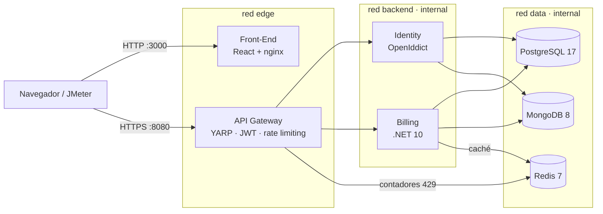

# Secunitec Platform

Plataforma de facturación electrónica con auditoría de seguridad para **Secunitec Corp.** Proyecto final de Arquitectura de Sistemas Informáticos (UNITEC, Q3-2026).

Es un prototipo full-stack de microservicios endurecidos, orquestados con Docker Compose en redes aisladas:

- un gateway que, bajo saturación, responde **429 controlados en lugar de fallar**;
- un proveedor de identidad OAuth 2.0 / OIDC;
- un núcleo de facturación en .NET 10;
- persistencia SQL + NoSQL.

## Arquitectura



| Componente | Qué hace | Carpeta |
|---|---|---|
| API Gateway | Única entrada: TLS, validación del JWT, rate limiting L7 con Redis (429 + `Retry-After`), CORS y cabeceras de seguridad | `src/Gateway` |
| Identity | OAuth 2.0 / OIDC con OpenIddict: login, JWT RS256, refresh tokens y bloqueo tras 5 intentos fallidos | `src/Identity` |
| Billing | Facturación en Clean Architecture con EF Core; permisos por rol (RBAC) y aislamiento por empresa (ABAC) | `src/Billing` |
| Persistencia | PostgreSQL (facturas y usuarios), MongoDB (auditoría solo de inserción), Redis (rate limiting y caché) | `infra/` |
| Front-End | SPA en React 19 servida por nginx sin privilegios: login PKCE, facturas, auditoría y panel de 429 en vivo | `src/Frontend` |
| Observabilidad (Fase 4) | OpenTelemetry con Prometheus, Tempo, Loki, cAdvisor y Grafana | `docker-compose.observability.yml` |

Solo tres servicios publican puertos, y solo en `127.0.0.1`: el gateway (8080), el Front-End (3000) y Grafana (3001). Los requisitos (`R01`-`R22`), las decisiones y los controles de seguridad están en [docs/PLAN.md](docs/PLAN.md).

## Requisitos

- Docker con Compose v2.
- .NET SDK 10.0.400, para el certificado de desarrollo y los tests.
- Opcionales:
  - Node 22 y pnpm 11 para los E2E;
  - Python 3 y JMeter 5.6 para las pruebas de estrés.
- En Windows, los scripts `.sh` se ejecutan desde Git Bash.

## Puesta en marcha

**1. Configuración.**

```bash
cp .env.example .env
```

En `.env`:

- Reemplazar cada `CAMBIAR_*` por un valor aleatorio (`python3 -c "import secrets; print(secrets.token_hex(24))"`).
- Definir `IDENTITY_SEED_DEMO_PASSWORD` para tener los usuarios de demostración.

**2. Certificados de desarrollo** (una sola vez):

```bash
scripts/dev-cert.sh                 # Windows: powershell -File scripts/dev-cert.ps1
dotnet dev-certs https --trust      # para que el navegador confíe en el gateway
```

**3. Levantar el sistema.**

```bash
docker compose up -d --build
docker compose ps                   # todo en healthy; mongo-setup termina con código 0
```

**4. Verificar la seguridad.**

```bash
scripts/verify-hardening.sh         # debe terminar con 0 FAIL
```

Si algo no arranca (MongoDB 8 en Docker Desktop, certificados, `mongo-setup`), ver [docs/problemas-conocidos.md](docs/problemas-conocidos.md).

## Uso

- **Aplicación:** <http://localhost:3000>. Usar `localhost`, no `127.0.0.1`.
- **Usuarios:**
  - el administrador de `IDENTITY_SEED_ADMIN_EMAIL`;
  - con `IDENTITY_SEED_DEMO_PASSWORD`: `facturador@`, `auditor@` y `cliente@secunitec.local`.
- **Qué puede hacer cada rol:**
  - el Facturador crea, emite y anula facturas;
  - el Auditor ve la auditoría;
  - el Cliente ve solo sus facturas.
- **Resiliencia:** el panel envía 120 peticiones en 10 s contra un límite de 60 por minuto. Muestra los 429 en vivo y la cuenta regresiva del `Retry-After`, sin ningún 5xx.

<details>
<summary>Probar la API con curl</summary>

```bash
export TOKEN=$(curl -s --cacert infra/certs/gateway.pem -X POST https://localhost:8080/connect/token \
  -d grant_type=client_credentials -d client_id=jmeter-load -d scope=secunitec-billing \
  --data-urlencode "client_secret=$(grep '^IDENTITY_JMETER_CLIENT_SECRET=' .env | cut -d= -f2-)" \
  | python3 -c "import json, sys; print(json.load(sys.stdin)['access_token'])")
curl -i --cacert infra/certs/gateway.pem -H "Authorization: Bearer $TOKEN" https://localhost:8080/api/billing/facturas
```

Crear una factura: `POST /api/billing/facturas` con `{"clienteId":"<SEED_CLIENTE_ID>","lineas":[{"descripcion":"Servicio","cantidad":1,"precioUnitario":100,"exento":false}]}`. Después: `POST .../{id}/emitir` y `POST .../{id}/anular` con `{"motivo":"..."}`. Los errores traen un `code` estable en ProblemDetails, por ejemplo `cai.vencido`.

</details>

## Observabilidad (Fase 4)

En `.env`:

- definir `GRAFANA_ADMIN_PASSWORD`;
- reemplazar la línea `COMPOSE_PROFILES` por las dos líneas comentadas de la observabilidad.

Luego:

```bash
docker compose up -d --build
scripts/verify-observability.sh     # métricas, traza gateway → billing → Postgres y logs
```

Grafana queda en <http://localhost:3001> (usuario `admin`), con tres dashboards: "Resiliencia del gateway", "USE Overview" y "Trazas". La justificación y el detalle están en [docs/06](docs/06-innovacion-opentelemetry.md).

## Pruebas y evidencia

| Qué se prueba | Comando | Resultado |
|---|---|---|
| .NET: dominio, casos de uso, API, Identity y gateway (Postgres, Mongo y Redis con Testcontainers) | `dotnet test Secunitec.slnx -c Release` | CI |
| Front-End | `cd src/Frontend && pnpm install && pnpm test` | CI |
| E2E contra el compose: login, facturas y 429 | `cd tests/e2e && pnpm install && pnpm exec playwright install chromium && pnpm test` | Local |
| Hardening de contenedores, redes y cabeceras | `scripts/verify-hardening.sh --report` | [docs/04](docs/04-hardening-verificacion.md) |
| Observabilidad | `scripts/verify-observability.sh --report` | [docs/evidencia/5.2](docs/evidencia/5.2/verificacion-observabilidad.md) |
| Estrés con JMeter y Método USE | `scripts/stress/run-jmeter.sh 03-spike` ([preparación](docs/05-pruebas-estres-use.md#7-cómo-reproducirlo)) | [docs/05](docs/05-pruebas-estres-use.md): 1 732 633 peticiones, 0 respuestas 5xx |

## Documentación

- [docs/PLAN.md](docs/PLAN.md): requisitos, arquitectura, fronteras de confianza, decisiones e hitos.
- [docs/04](docs/04-hardening-verificacion.md), [docs/05](docs/05-pruebas-estres-use.md) y [docs/06](docs/06-innovacion-opentelemetry.md): evidencia del hardening, de las pruebas de estrés y de la observabilidad.
- `docs/ETAPA_*.md`: el detalle de cada etapa.
- El modelado de amenazas (STRIDE), los diagramas SecurUML y el mapeo OWASP de la Fase 1 se entregan con el informe técnico.

## Estado

| Etapa | Estado |
|---|---|
| 1-2. Solución .NET, reglas de facturación y bases de datos | Completa ([#1](https://github.com/PickleRickHND/secunitec-platform/pull/1), [#2](https://github.com/PickleRickHND/secunitec-platform/pull/2)) |
| 3. Identity y gateway | Completa ([#3](https://github.com/PickleRickHND/secunitec-platform/pull/3)) |
| 4. Front-End y hardening | Completa ([#4](https://github.com/PickleRickHND/secunitec-platform/pull/4)) |
| 5. Amenazas, OpenTelemetry y pruebas de estrés | Completa ([#5](https://github.com/PickleRickHND/secunitec-platform/pull/5)); faltan el informe y la presentación (5.4) |

Límites conocidos:

- Los usuarios que se registran solos quedan sin rol hasta que un administrador se lo asigne, y no hay pantalla para hacerlo.
- El rate limiting no se probó con varias instancias del gateway.
- La auditoría no usa un outbox transaccional: si Mongo falla justo después de confirmar en Postgres, puede quedar una operación sin evento (queda un warning en el log).
- Los E2E corren en local, no en CI, porque necesitan los certificados y los secretos.
