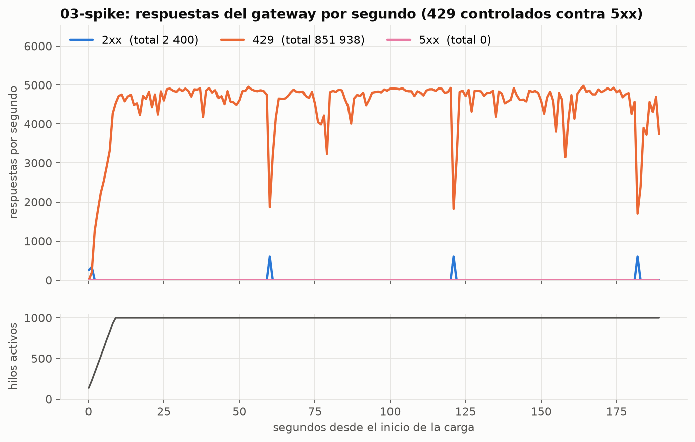

# Fase 3 · Pruebas de estrés y Método USE (R16, R17, R18)

Etapa 5.3 del plan (hito H9). La Fase 3 pide tres cosas:

- someter el sistema a alta concurrencia con Apache JMeter;
- medir los recursos con `docker stats` y el Método USE;
- demostrar con evidencia empírica que, bajo saturación, el gateway responde **429 controlados en lugar de 500**.

Todo lo que sigue sale de ejecuciones reales contra el compose, con la observabilidad de la etapa 5.2 levantada.

## 1. Entorno

| Elemento | Valor |
|---|---|
| Máquina | Apple M3 Pro, macOS 27.0 |
| VM de Docker Desktop | 11 CPU, 7.7 GiB, kernel 7.0.12-linuxkit; Docker 29.8.0, Compose 5.5.1 |
| JMeter | 5.6.3 (Homebrew) sobre OpenJDK 21, en el host, contra `https://localhost:8080`; heap de 1 a 3 GB |
| Stack | `docker compose -f docker-compose.yml -f docker-compose.observability.yml --profile security --profile observability` (13 contenedores) |
| Muestreo de trazas | 10 % (`OTEL_TRACE_SAMPLE_RATIO=0.1`) para que Tempo no compita por CPU con el sistema bajo prueba (docs/06) |

Límites relevantes (`deploy.resources.limits`, etapa 4.2):

| Contenedor | CPU | Memoria | Por qué importa |
|---|---|---|---|
| gateway | 1.0 | 256 MiB | TLS, validación del JWT y rate limiting de cada petición |
| billing | **0.5** | **256 MiB** | Bajos a propósito, para poder saturarlo en una laptop (PLAN §10) |
| redis | 0.25 | 192 MiB | Un contador del rate limiting por petición (script Lua de RedisRateLimiting) |
| identity | 1.0 | 384 MiB | Solo interviene en los canjes de token |
| postgres | 1.0 | 512 MiB | `max_connections` 100, compartido por Billing e Identity |

Los límites del rate limiting son los del plan y no se tocaron:

- 60 peticiones por minuto por `sub` (`user-by-sub`);
- 60 por IP sin token (`anon-by-ip`);
- 5 canjes por minuto por IP en `/connect/token`.

## 2. Cómo se generó la carga

**Varios clientes para no chocar con la partición por `sub` (PLAN §10).**

- Con un solo `jmeter-load`, todas las peticiones compartirían una partición de 60 por minuto.
- En Development, Identity siembra además `jmeter-load-01` a `jmeter-load-10` (`IDENTITY_JMETER_LOAD_CLIENTS=10`). Cada uno tiene su propio `sub` y, por lo tanto, su partición: en conjunto el gateway admite hasta **600 peticiones por minuto** (10 por segundo).
- Escriben en un tenant de carga propio (`IDENTITY_JMETER_LOAD_TENANT_ID`, sembrado por Billing), así el tenant de ejemplo del SPA no se llena de borradores.
- Código: `src/Identity/Secunitec.Identity/JmeterClients.cs`, `ConnectEndpoints.cs` y `src/Billing/Secunitec.Billing.Infrastructure/BillingDemoSeeder.cs`.

**Tokens.**

- El setUp thread group de cada plan pide los 10 tokens por client credentials y respeta el `Retry-After` de `/connect/token`: 5 canjes por minuto, así que tarda unos 60 s.
- El secreto llega por la variable de entorno `JMETER_CLIENT_SECRET`, nunca con `-J`, porque JMeter registra esas propiedades en su log.
- La conexión que pide los tokens valida el certificado del gateway.

**Mezcla por iteración** (Switch Controller):

| Petición | Proporción |
|---|---|
| Lista de facturas, con página y estado al azar para no servirlo todo desde la caché de Redis (30 s) | 60 % |
| Detalle por id | 20 % |
| Alta de un borrador | 17 % |
| Emisión, que bloquea la fila del rango del CAI | 3 % |

Cada hilo usa el token del cliente `(hilo % 10) + 1`.

**Qué cuenta como error.**

- Una aserción acepta 200, 201 y 429. En el reporte HTML de JMeter, "error" es cualquier otra cosa: 401, 403, 5xx o una falla de conexión. Así el porcentaje de error es el de fallas reales, no el de rechazos controlados.
- Cada hilo reusa su conexión TLS (`httpclient.reset_state_on_thread_group_iteration=false`), como un cliente real con keep-alive.

| Plan | Carga | Duración | Pausa entre peticiones |
|---|---|---|---|
| `01-baseline.jmx` | 50 hilos, rampa de 30 s, ritmo total fijo de 480 por minuto (80 % de la capacidad de las 10 particiones) | 5 min | la que impone el ritmo |
| `02-ramp-saturation.jmx` | De 0 a 500 hilos en 8 min, luego 2 min sostenidos | 10 min | 100 a 300 ms |
| `03-spike.jmx` | 1000 hilos en 10 s, sostenidos 3 min | 3 min 10 s | 100 a 300 ms |

Los tres planes salen de `tests/jmeter/generar-planes.py`, así comparten estructura; los `.jmx` se versionan.

**Evidencia de cada corrida.** `scripts/stress/run-jmeter.sh <plan>` hace todo en un paso:

- arranca `scripts/stress/capture-docker-stats.sh`: `docker stats` a CSV, una muestra por contenedor por segundo, en modo streaming;
- corre JMeter en modo no GUI con reporte HTML;
- guarda el rango de tiempo para Grafana.

Después, `scripts/stress/analizar.py` produce las gráficas y la tabla USE. Para la saturación que `docker stats` no ve, consulta Prometheus: throttling de CPU, cola del thread pool, pool de Npgsql y eventos de memoria. Las capturas de Grafana se toman con `tests/e2e/specs/grafana.spec.ts` en esa misma ventana.

## 3. Resultados (configuración final)

Tres corridas seguidas el 2026-09-23 entre las 10:21 y las 10:42 (hora de Honduras), con las dos correcciones de la sección 4 aplicadas.

| Plan | Hilos | Duración | Peticiones | Throughput | 2xx (aceptadas) | 429 | **5xx** | Fallas de conexión |
|---|---|---|---|---|---|---|---|---|
| 01-baseline | 50 | 300 s | 2 392 | 8.0/s | 2 392 (100 %) | 0 | **0** | 0 |
| 02-ramp-saturation | 0 → 500 | 600 s | 875 903 | 1 460/s | 6 000 | 869 903 (99.3 %) | **0** | 0 |
| 03-spike | 1000 | 190 s | 854 338 | 4 498/s | 2 400 | 851 938 (99.7 %) | **0** | 0 |

| Plan | Latencia 2xx p50 / p95 / p99 | Latencia 429 p50 / p95 / p99 |
|---|---|---|
| 01-baseline | 11 / 25 / 69 ms | — |
| 02-ramp-saturation | 4 / 56 / 148 ms | 1 / 6 / 25 ms |
| 03-spike | 1 290 / 1 898 / 1 948 ms | 2 / 59 / 141 ms |

**Lectura de los resultados**

- **Línea base.** Por debajo del límite, todo se acepta, sin 429 y con p95 de 25 ms. El sistema no rechaza tráfico legítimo.
- **Rampa y pico.**
  - El gateway acepta exactamente la capacidad configurada: **10 peticiones por segundo**, 600 por minuto de los 10 clientes. Aceptó 6 000 en los 10 minutos de la rampa y 2 400 en las tres ventanas del pico.
  - Todo el excedente recibe **429 en milisegundos**: p50 de 1 a 2 ms, sin tocar Billing.
  - El contador propio `secunitec_gateway_rate_limited_total` coincide exactamente con JMeter. Entre el inicio y el fin de cada corrida, la partición `user-by-sub` sube 869 903 en la rampa y 851 938 en el pico, los mismos 429 que contó JMeter. Los valores de `resumen.md` (873 795 y 882 001) salen de `increase()`, que extrapola en los bordes de la ventana.
- **R18 se cumple:** **0 respuestas 5xx y 0 fallas de conexión en 1 732 633 peticiones.**
- **La latencia de las aceptadas en el pico sube a 1.3 a 1.9 s.** No es el rate limiting: es el costo de atender 600 peticiones que llegan juntas a un Billing de 0.5 CPU (sección 5). El gateway prioriza sobrevivir la ráfaga sin errores antes que la latencia de cada petición.

Gráficas por corrida en `docs/evidencia/5.3/<plan>/`:

- `respuestas-por-segundo`: la gráfica "429 contra 500", con los hilos activos debajo;
- `latencia`;
- `cpu` y `memoria` contra el límite de cada contenedor;
- `resumen.md` con la tabla USE completa;
- `grafana/` con los tres dashboards en la ventana exacta de la prueba.



En el pico, la curva naranja son los 429: unos 4 800 por segundo. Los picos azules, cada 61 s, son las 600 aceptadas de cada ventana. La línea rosa de 5xx queda en cero durante toda la prueba.

## 4. Lo que encontró la prueba: dos fuentes de 5xx, corregidas

La primera ronda no cumplió R18: aparecieron 5xx. Ninguno venía del rate limiting ni de la falta de CPU. Los dos venían de cómo la ventana fija de 60 s concentra el tráfico aceptado:

- **Todo entra al abrirse la ventana.** Cada uno de los 10 clientes recibe sus 60 permisos en el primer instante: **600 peticiones llegan juntas a Billing cada 61 s**, y después hay 52 s sin tráfico.
- **La carga que llega a Billing es periódica, no pareja.**

Cada hallazgo se diagnosticó con la evidencia de las propias herramientas, se corrigió sin bajar los límites y se volvió a medir.

### 4.1 Rampa: 3 respuestas 502 de 877 348

| | |
|---|---|
| Síntoma | 3 `GET /api/billing/facturas` con 502 en el mismo instante (09:57:57.1), en 72 a 106 ms, los tres del cliente `jmeter-load-02` |
| Evidencia | El gateway registró `Yarp.ReverseProxy.Forwarder.HttpForwarder[48]` con `HttpIOException: The response ended prematurely (ResponseEnded)` (`docs/evidencia/5.3/hallazgo-502/gateway-yarp-502.log`). Billing no se reinició ni tuvo OOM. Las ráfagas aceptadas se abren cada 61 s (09:50:50, 09:51:51, ..., 09:57:57) |
| Causa | Carrera de keep-alive. Tras cada ráfaga, las conexiones de YARP a Billing quedan inactivas unos 60 s. Tanto el keep-alive de Kestrel en Billing (`KestrelExtensions.KeepAliveTimeout`, 60 s) como la vida de una conexión inactiva en el pool de YARP (`SocketsHttpHandler`, 60 s por defecto) valen lo mismo. Al abrirse la ventana siguiente, YARP reusó conexiones que Billing estaba cerrando |
| Corrección | `src/Gateway/Secunitec.Gateway/GatewayForwarderHttpClientFactory.cs`: el pool de YARP suelta las conexiones inactivas a los 30 s, la mitad del keep-alive de los servicios internos. Regla general: el cliente suelta antes de que el servidor cierre. Test de regresión en `tests/Secunitec.Gateway.Tests/GatewayForwarderTests.cs` |
| Resultado | La rampa repetida con la corrección terminó sin 5xx |

### 4.2 Pico: 33 respuestas 500 de 827 417

| | |
|---|---|
| Síntoma | 19 listas y 14 altas con 500, en tres grupos (10:16:08, 10:17:09, 10:18:10: otra vez cada 61 s), con 1.1 a 7.6 s de latencia |
| Evidencia | Billing registró `Npgsql.PostgresException 53300: remaining connection slots are reserved for roles with the SUPERUSER attribute` (`docs/evidencia/5.3/hallazgo-500/billing-postgres-53300.log`) |
| Causa | Con 1000 hilos, las 600 peticiones aceptadas de cada ventana llegan a Billing prácticamente a la vez. El pool de Npgsql de Billing admite hasta 100 conexiones por defecto y el de Identity otras 100. Postgres solo acepta 97 conexiones de roles sin SUPERUSER (`max_connections` 100 menos 3 reservadas) |
| Corrección | `Maximum Pool Size=50` en Billing y `=20` en Identity (`docker-compose.yml`): suman 70 y caben en las 97. Con el pool lleno, la petición espera una conexión libre (hasta 15 s) en vez de fallar. `scripts/verify-hardening.sh` verifica desde ahora que la suma de los pools quepa en Postgres |
| Resultado | Las tres corridas repetidas con las dos correcciones terminaron sin 5xx (sección 5) |

Hay evidencia completa de las corridas con error (resumen, gráficas y capturas de Grafana) en `docs/evidencia/5.3/hallazgo-502/` y `hallazgo-500/`. Ninguna corrección tocó los límites del rate limiting, los de CPU y memoria de Billing ni la lógica de negocio.

## 5. Método USE

**Utilización, saturación y errores** por recurso, en la corrida más exigente de cada tipo. La utilización es contra el **límite del contenedor**, no contra la máquina.

| Recurso | Contenedor | Rampa: U / S / E | Pico: U / S / E |
|---|---|---|---|
| CPU | gateway (1 CPU) | media 31 %, máx. 80 % / throttling máx. 4 % / — | **media 83 %, máx. 104 %** / **throttling máx. 39 %** / — |
| CPU | billing (0.5 CPU) | media 5 %, máx. 51 % / throttling máx. 24 % / — | media 5 %, **máx. 104 %** al abrirse cada ventana / throttling máx. 29 % / — |
| CPU | redis (0.25 CPU) | media 23 %, máx. 59 % / 6 % / — | **media 63 %, máx. 87 %** / 7 % / — |
| CPU | postgres (1 CPU) | máx. 20 % / 0 % / — | máx. 67 % / 17 % / — |
| Memoria | gateway (256 MiB) | media 76 %, máx. 88 % / 0 eventos de límite / 0 OOM | **media 89 %, máx. 95 %** / 0 / 0 OOM |
| Memoria | billing (256 MiB) | media 59 %, máx. 69 % / 0 / 0 OOM | **media 82 %, máx. 91 %** / **162 veces en el límite** / 0 OOM |
| Red | gateway | máx. 20 MB/s / — / 0 paquetes con error | máx. 20 MB/s / — / 0 |
| Conexiones a Postgres | billing (pool de 50) | 14 322 consultas, p95 3.5 ms; 32 conexiones nuevas / sin espera / 0 5xx | 6 373 consultas, **p95 94 ms**; 52 conexiones nuevas / **hasta 99 peticiones esperando conexión** / **0 5xx** |
| Thread pool .NET | gateway | máx. 5 hilos / cola máx. 4 / — | máx. 5 hilos / **cola máx. 335** / — |
| Thread pool .NET | billing | máx. 15 hilos / cola 0 / — | máx. 10 hilos / **cola máx. 496** / — |
| Rate limiting | gateway | 10 aceptadas/s, 1 450 rechazadas/s / 99.3 % de 429 / 0 5xx | 12.6 aceptadas/s, 4 485 rechazadas/s / 99.7 % de 429 / 0 5xx |

Fuentes:

- **Utilización de CPU, memoria y red:** `docker stats`, una muestra por segundo.
- **Throttling de CPU y eventos de memoria:** cAdvisor en Prometheus.
- **Pool de Npgsql y thread pool:** métricas de .NET por OpenTelemetry.
- **429 y 5xx:** JMeter y `secunitec_gateway_rate_limited_total`.

Detalle por corrida en `docs/evidencia/5.3/<plan>/resumen.md`.

**Qué dice el USE**

1. **El cuello de botella bajo ataque es el gateway, y así debe ser.** En el pico usa el 83 % de su CPU en promedio (con picos de 104 % y 39 % de periodos frenados por el límite) y acumula hasta 335 trabajos en cola, pero responde cada petición con un código controlado. Ahí se descarta el abuso, lejos de los datos.
2. **Redis es el segundo recurso más cargado:** 63 % de sus 0.25 CPU en el pico, porque el rate limiting hace una operación por petición. No hubo fallback al limitador en memoria: 0 avisos en el log del gateway. Es el primer candidato a más CPU si la carga crece.
3. **Billing, el recurso que el diseño protege, trabaja en ráfagas.** Pasa la mayor parte del tiempo cerca de 0 % y sube a su límite (104 % de 0.5 CPU) solo al abrirse cada ventana, cuando llegan las 600 aceptadas juntas. En el pico su memoria toca el límite 162 veces y su pool llega a tener 99 peticiones esperando conexión, pero **no hay errores**: el tope del pool convierte la saturación en espera y no en 500.
4. **Postgres queda holgado** (máximo 67 % de CPU en las ráfagas del pico): el tope de conexiones lo protege.

## 6. Conclusiones

- **R18 cumplido con evidencia empírica:** 1 732 633 peticiones en las tres corridas (1 730 241 de rampa y pico); 1 721 841 respuestas 429 controladas (con `Retry-After`) y **cero 5xx**. El rate limiting L7 hace lo que promete: la carga que llega a Billing no depende de la carga de entrada: unas 10 peticiones por segundo (600 por minuto) tanto con 500 como con 1000 usuarios.
- **La prueba de estrés encontró dos defectos reales** que las pruebas funcionales no podían ver: la carrera de keep-alive (502) y el tamaño de los pools frente a Postgres (500). Los dos venían de cómo la ventana fija concentra el tráfico aceptado en ráfagas. Se corrigieron sin tocar los límites y quedaron protegidos con un test de regresión y con un control de `verify-hardening.sh`.
- **Recomendaciones para producción:**
  - **Ventanas deslizantes o token bucket.** Suavizarían las ráfagas de apertura de ventana que causaron ambos hallazgos. Hoy la aceptación llega en bloques de 600 cada 61 s. `RedisRateLimiting` ofrece ventana deslizante y token bucket.
  - **Más CPU para Redis, o un Redis dedicado al rate limiting**, si la carga de entrada crece más allá de ~5 000 peticiones/s.
  - **Un límite de concurrencia en Billing.** Mantendría acotada la latencia de las aceptadas en los picos: hoy llega a ~1.9 s.

## 7. Cómo reproducirlo

```bash
# .env: IDENTITY_JMETER_LOAD_CLIENTS=10 (y el tenant de carga); stack con la observabilidad
OTEL_TRACE_SAMPLE_RATIO=0.1 docker compose -f docker-compose.yml -f docker-compose.observability.yml \
  --profile security --profile observability up -d --build
python3 -m venv .venv-stress && .venv-stress/bin/pip install -r scripts/stress/requirements.txt

scripts/stress/run-jmeter.sh 01-baseline          # también 02-ramp-saturation y 03-spike
.venv-stress/bin/python scripts/stress/analizar.py tests/jmeter/results/<fecha>-<plan> --evidencia docs/evidencia/5.3/<plan>
(set -a; . tests/jmeter/results/<fecha>-<plan>/rango.env; set +a
 cd tests/e2e && GRAFANA_CAPTURAS=$PWD/../../docs/evidencia/5.3/<plan>/grafana pnpm exec playwright test specs/grafana.spec.ts)
```

- **El cupo de `/connect/token` es compartido.** Cada plan gasta 10 canjes, un minuto de cupo. Si antes corrió `verify-hardening.sh` o los E2E, el setUp espera el `Retry-After`.
- **Después de las pruebas**, recrear el gateway antes de `verify-hardening.sh`. Si Redis llega a saturarse, el aviso de fallback queda en el log y ese control falla hasta el reinicio.
- **Lo que no se versiona.** El JTL crudo (≈ 70 MB por corrida) y el reporte HTML de JMeter quedan en `tests/jmeter/results/`, ignorados por git. Se versionan el resumen, las gráficas y las capturas.

## 8. Limitaciones

- **Una sola máquina.** JMeter corre en la misma máquina que Docker Desktop y compite por CPU con el sistema bajo prueba. La red del host a la VM de Docker agrega latencia y no es una red real.
- **Una sola IP.** Todas las peticiones del host llegan con la IP de la puerta de enlace de Docker (docs/problemas-conocidos.md §9). Por eso la carga se reparte por `sub` (clientes de carga) y no por IP.
- **Efecto del observador.** La observabilidad (collector, Prometheus, Tempo, Loki, cAdvisor y Grafana) consume hasta 2.5 CPU. Las trazas se muestrearon al 10 % para acotarlo.
- **Gauges muestreados cada 5 s.** El uso del pool y la cola del thread pool pueden no captar picos de 1 a 2 s. Los contadores y los histogramas sí son exactos sobre la ventana.
