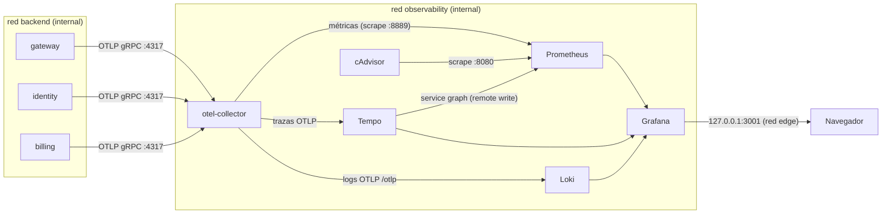

# Fase 4 · Innovación: observabilidad con OpenTelemetry (R19)

Etapa 5.2 del plan (hito H8). La Fase 4 pide incorporar una tecnología que no se vio en clase y justificar su valor. Elegimos **OpenTelemetry** con Prometheus, Tempo, Loki, cAdvisor y Grafana (docs/PLAN.md §0). Este documento cubre:

- por qué la elegimos;
- cómo está integrada;
- qué mide;
- cómo protege los datos;
- cómo se verifica.

## 1. Qué es y por qué la elegimos

OpenTelemetry es el estándar abierto de la CNCF para instrumentar aplicaciones. Define **una sola API y un solo protocolo (OTLP)** para las tres señales de la observabilidad:

- **Trazas:** el recorrido de una petición a través de los servicios.
- **Métricas:** contadores e histogramas agregados en el tiempo.
- **Logs:** eventos con contexto.

El código se instrumenta una vez y el destino se elige en el collector, sin tocar la aplicación. Qué aporta a Secunitec:

| Necesidad de Secunitec | Cómo la resuelve OpenTelemetry |
|---|---|
| Demostrar ante el comité que el gateway devuelve 429 controlados y no 500 (R18) | Métricas en vivo de 2xx, 429 y 5xx por segundo; la prueba de estrés (5.3) queda registrada en Prometheus, no solo en el reporte de JMeter |
| Aplicar el Método USE por recurso (R17) | cAdvisor (CPU, memoria, red y throttling por contenedor) más las métricas del runtime de .NET y del pool de Npgsql |
| Encontrar dónde se va el tiempo de una factura lenta | Una traza cruza gateway → billing → Postgres/Mongo con la duración de cada consulta |
| Unir la auditoría (Mongo) con lo que pasó en la plataforma | El `X-Correlation-Id` viaja como atributo de la traza (`secunitec.correlation_id`) y en los logs. Cada evento de auditoría de Billing e Identity también es un log, enlazado a su traza |
| No atarse a un proveedor | OTLP es neutral: el mismo código podría enviar a Grafana Cloud, Datadog o Azure Monitor cambiando solo el collector |

**Ventaja competitiva.** Una empresa de seguridad que vende confianza puede mostrar evidencia en tiempo real (tableros y trazas) en vez de afirmaciones. El tiempo de diagnóstico (MTTR) baja: de una factura lenta se pasa a su traza, y de la traza a los eventos de auditoría que produjo, en un clic. Los 429 se ven como métrica y como traza. El mismo stack permitiría agregar alertas sobre abuso, porque un pico de `secunitec_gateway_rate_limited_total` es un intento de saturación en curso; en este prototipo no hay reglas de alerta configuradas.

## 2. Arquitectura



- **Archivo aparte y perfil opcional.** Todo vive en `docker-compose.observability.yml`, con el perfil `observability`. El compose principal sigue funcionando igual sin él.
- **TB3 (servicios → observabilidad).** Solo la cruza el collector. Está en `backend` para recibir OTLP y en `observability` para repartir (`docker-compose.observability.yml:53`). Identity y Billing no cambian de red ni ganan salida a Internet.
- **`observability` es `internal: true`** (`docker-compose.yml:266-267`). Collector, Prometheus, Tempo, Loki y cAdvisor no tienen salida ni puertos publicados.
- **Grafana** también se une a `edge`, solo para publicar `127.0.0.1:3001` (`docker-compose.observability.yml:185`).

| Componente | Imagen | Rol |
|---|---|---|
| otel-collector | `otel/opentelemetry-collector-contrib:0.161.0` | Recibe OTLP y reparte cada señal; borra atributos sensibles (TB3) |
| Prometheus | `prom/prometheus:v3.14.0` | Métricas (scrape cada 5 s, 7 días de retención) |
| Tempo | `grafana/tempo:3.0.3` | Trazas en modo monolítico (sin Kafka) y service graph |
| Loki | `grafana/loki:3.7.8` | Logs por OTLP nativo, con `trace_id` como metadato |
| cAdvisor | `ghcr.io/google/cadvisor:v0.60.6` | CPU, memoria, red y throttling por contenedor |
| Grafana | `grafana/grafana:13.2.2` | Tres dashboards provisionados, con login obligatorio |

## 3. Instrumentación de los servicios

`AddSecunitecTelemetry()` (`src/BuildingBlocks/Secunitec.BuildingBlocks.AspNetCore/Hosting/TelemetryExtensions.cs`) configura las tres señales igual en los tres servicios:

- **Recurso:** `service.name` y `deployment.environment.name`.
- **ASP.NET Core y HttpClient.** Sin `/health`, filtrado en `TelemetryExtensions.cs:86`.
- **Meters integrados:** `System.Runtime`, `Microsoft.AspNetCore.RateLimiting` y `Microsoft.AspNetCore.Diagnostics`.
- **Logs OTLP con scopes:** el correlation id llega a Loki (`TelemetryExtensions.cs:107`).
- **Qué se registra:** el arranque, las fallas (Redis o Mongo no disponibles, respaldo del rate limiting) y un log Information por cada evento de auditoría de Billing e Identity (`MongoAuditoria.cs`, `IdentityAuditWriter.cs`). Esos logs llevan la acción, el resultado y el recurso, pero no el actor, la IP ni el detalle, que quedan solo en Mongo. Las peticiones normales y los 429 no escriben logs: bajo un ataque de miles de peticiones por segundo inundarían Loki, y ya están en las métricas y las trazas.
- **Exportación opcional.** Solo exporta si existe `OTEL_EXPORTER_OTLP_ENDPOINT` (`TelemetryExtensions.cs:111-115`). Los tests y el compose sin observabilidad no abren conexiones.

| Servicio | Registro | Fuentes y meters propios |
|---|---|---|
| gateway | `src/Gateway/Secunitec.Gateway/Program.cs:22` | `Yarp.ReverseProxy`, `Secunitec.Gateway`; TB0 (sección 6) |
| identity | `src/Identity/Secunitec.Identity/Program.cs:21` | `Npgsql` (trazas y pool), `MongoDB.Driver` |
| billing | `src/Billing/Secunitec.Billing.Api/Program.cs:23` | `Npgsql`, `MongoDB.Driver`, `Secunitec.Billing` |

**Sin paquetes beta:** las instrumentaciones de Redis y de EF Core solo existen en `1.19.0-beta.1`.

- Npgsql 10, el driver de MongoDB 3.12 y YARP traen sus propias fuentes, así que las consultas a Postgres y a Mongo aparecen igual en las trazas.
- Las llamadas a Redis no generan spans. Su efecto se ve en la latencia del span padre y en el CPU del contenedor `redis` (USE Overview).

**Muestreo:** `Telemetry:TraceSampleRatio`, variable `OTEL_TRACE_SAMPLE_RATIO` en `.env`.

- Por defecto se guardan todas las trazas.
- En las pruebas de estrés conviene 0.1, para que Tempo no compita por CPU con el sistema bajo prueba (docs/05).

## 4. Métricas propias

| Instrumento (OTel) | En Prometheus | Tipo y etiquetas | Dónde se registra | Test |
|---|---|---|---|---|
| `secunitec.gateway.rate_limited` | `secunitec_gateway_rate_limited_total` | Counter; `policy` | `OnRejected`, `src/Gateway/Secunitec.Gateway/GatewayRateLimiting.cs:62` | `tests/Secunitec.Gateway.Tests/GatewayTelemetryTests.cs:23` y `:42` |
| `secunitec.gateway.retry_after` | `secunitec_gateway_retry_after_seconds_*` | Histograma en segundos; `policy` | El mismo `OnRejected` | `GatewayTelemetryTests.cs:23` |
| `secunitec.billing.invoices_emitted` | `secunitec_billing_invoices_emitted_total` | Counter, sin etiquetas | Después del commit de la emisión, `src/Billing/Secunitec.Billing.Application/FacturasService.cs:89`, a través del puerto `IMetricasFacturacion` | `tests/Secunitec.Billing.Application.Tests/FacturasServiceTests.cs:223` y `:235`; `tests/Secunitec.Billing.Infrastructure.Tests/MetricasFacturacionTests.cs:10` |

- **El histograma de `Retry-After` se agregó al plan** para el panel "Retry-After" que pide el criterio de 5.2.
- **Etiquetas.** Ninguna métrica lleva IP, `sub`, tenant ni cliente: son datos personales o del negocio, con cardinalidad sin límite.
- **Contraste.** La métrica integrada `aspnetcore.rate_limiting.requests` sirve para comparar la propia en el dashboard.

## 5. Dashboards

Los tres están provisionados desde `infra/grafana/dashboards/` en la carpeta "Secunitec" y son de solo lectura en la UI.

- **Colores:** la paleta categórica de referencia del skill dataviz, validada para daltonismo en modo claro con `validate_palette.js`. Las clases de respuesta usan los mismos colores que el panel de resiliencia del SPA.
- **Leyendas:** en tabla con último valor, máximo y media, así la identidad nunca depende solo del color.

| Dashboard | Qué muestra | Criterio que cubre |
|---|---|---|
| **Resiliencia del gateway** (inicio de Grafana) | Totales de 2xx, 429 y 5xx (el tile de 5xx es verde con 0 y rojo desde 1); respuestas por segundo por clase; lo que recibe el gateway frente a lo que llega a Billing; rechazos por política; `Retry-After` p50/p95; latencia p95; facturas emitidas | R02, R10, R18 |
| **USE Overview** | Por contenedor: CPU usada contra el límite y throttling; memoria contra el límite y eventos de límite/OOM; red y errores. Por servicio: conexiones del pool de Npgsql, cola del thread pool y 5xx | R17 |
| **Trazas** | Service graph (gateway → billing → postgres/mongo), últimas trazas de Billing, trazas con consultas a Postgres, trazas lentas, p95 por servicio (span metrics) y logs de Loki enlazados a su traza | R19 y criterio de done de 5.2 |

Capturas con tráfico real: `docs/evidencia/5.2/grafana-*.png`. Se generan con `GRAFANA_CAPTURAS=<carpeta> pnpm exec playwright test specs/grafana.spec.ts` en `tests/e2e`.

## 6. Seguridad y privacidad (TB0 y TB3)

| Riesgo | Control | Evidencia |
|---|---|---|
| Un cliente de Internet fija el trace id o inyecta `baggage` en los servicios internos (spoofing de telemetría, confusión en la auditoría) | El gateway no extrae el contexto de traza entrante y abre siempre una traza nueva. Hay dos lectores del `traceparent`, y se reemplazan ambos: el propagador del hosting (DI) y el propagador global de OpenTelemetry, que la instrumentación de ASP.NET Core usa por su cuenta (`TelemetryExtensions.cs:69-71`, `EdgeTraceContextPropagators.cs`) | `GatewayTelemetryTests.cs:55`, verificado por mutación: sin el control, el trace id del cliente llega a Billing. `scripts/verify-observability.sh`: Tempo no tiene la traza con el id del cliente |
| Datos sensibles en trazas o logs (tokens, query strings, cabeceras) | La instrumentación no registra cabeceras y redacta la query. El collector además borra `url.query`, `url.full`, `http.*.header.*` y `enduser.id` (`infra/otel/otel-collector.yaml:25-35`). Npgsql guarda el SQL parametrizado, nunca los valores; Mongo no guarda el texto de la consulta (default del driver). Los logs de auditoría no llevan actor, IP ni detalle | `verify-observability.sh`: "ningún span con query string ni cabeceras HTTP" y "el log de auditoría no lleva IP, actor ni detalle"; `MongoAuditoriaTests.cs`, `IdentityAuditWriterTests.cs` |
| Acceso no autorizado a los tableros | Grafana con login, sin anónimos ni registro, sin llamadas a grafana.com, solo en `127.0.0.1:3001`. La contraseña viene de `.env` (`GRAFANA_ADMIN_PASSWORD`) | `verify-hardening.sh`, sección TB3 (401 sin credenciales, puerto y placeholder) |
| Exfiltración desde la observabilidad | Red `observability` internal; solo el collector toca `backend` | `verify-hardening.sh`, R12 y TB3 |
| Contenedores de observabilidad como punto de entrada | Hardening de 4.2 en los seis: sin root, `cap_drop: ALL`, solo lectura con tmpfs, `no-new-privileges` y límites de CPU, memoria y procesos | `docs/04-hardening-verificacion.md` (tabla de contenedores) |
| **Riesgo aceptado:** cAdvisor | Corre sin root (uid 65534, grupo 0, dueño de los sockets en la VM de Docker Desktop). Aun así, lee el socket de Docker, lo que equivale a controlar el host, y usa `pid: host` para medir la red por contenedor. Queda en una red internal, sin puertos, y documentado en STRIDE. En producción se reemplazaría por un proxy del socket de solo lectura o por las métricas del orquestador | `verify-hardening.sh`: "Solo cAdvisor monta el socket de Docker, y en solo lectura" y "Solo cAdvisor usa el espacio de PIDs del host" |

## 7. Cómo levantarla y verificarla

```bash
# .env: GRAFANA_ADMIN_PASSWORD, las líneas COMPOSE_FILE y COMPOSE_PROFILES de la observabilidad (.env.example)
# y, opcional, OTEL_TRACE_SAMPLE_RATIO
docker compose up -d --build
scripts/verify-observability.sh --report   # genera tráfico y comprueba métricas, traza y logs
scripts/verify-hardening.sh --report       # incluye los contenedores nuevos y los controles de TB3
```

Grafana queda en `http://localhost:3001` (usuario `admin`). La traza de una emisión se busca en "Trazas" o en Explore con TraceQL: `{span.secunitec.correlation_id="<X-Correlation-Id>"}`.

**Evidencia del criterio de done** (`docs/evidencia/5.2/verificacion-observabilidad.md`): la traza de una emisión real tiene spans de:

- el gateway: ASP.NET Core, YARP y HttpClient;
- Billing: ASP.NET Core;
- seis consultas a Postgres (`db.system.name=postgresql`);
- la inserción de auditoría en Mongo.

Además, el log de ese evento de auditoría llega a Loki con el mismo correlation id y el trace id de la traza.

Cuánto consume la observabilidad: con los límites del compose suma hasta 2.5 CPU y 2.5 GiB (collector 0.5/256M, Prometheus, Tempo, Loki y Grafana 0.5/512M cada uno, cAdvisor 0.25/256M).

- Los servicios en Go llevan `GOMEMLIMIT`: el runtime no lee el límite del cgroup, y Grafana terminaba por OOM con 256M.
- En la etapa 5.3 se mide el efecto del observador (docs/05).

## 8. Decisiones y desviaciones frente al plan

| Punto | Decisión | Motivo |
|---|---|---|
| Red del collector | En `backend` + `observability`; `observability` internal y Grafana también en `edge` | Identity y Billing no ganan salida a Internet; nada de la observabilidad sale salvo el puerto de Grafana en localhost |
| Instrumentaciones de Redis y EF Core | No se usan | Solo existen en beta; las fuentes nativas de Npgsql y Mongo cubren la base de datos |
| cAdvisor | Sin root, con `pid: host` y el socket de Docker | Sin `pid: host` no hay red por contenedor, que pide el criterio de 5.2. Riesgo aceptado (sección 6) |
| Métrica adicional | `secunitec.gateway.retry_after` | El panel "Retry-After" del criterio necesitaba el dato |
| Grafana | 512M y `GOMEMLIMIT` | Con 256M terminaba por OOM al cargar los tres dashboards |
| Verificación | `scripts/verify-observability.sh` | Hace reproducible el criterio de done en lugar de depender de capturas manuales |
| Logs de auditoría (cierre de la etapa 5) | Un log Information por evento de auditoría, sin datos personales; sin logs por petición | Antes, los servicios solo escribían logs al arrancar o ante fallas, y el panel de logs de "Trazas" quedaba vacío con el sistema sano |
