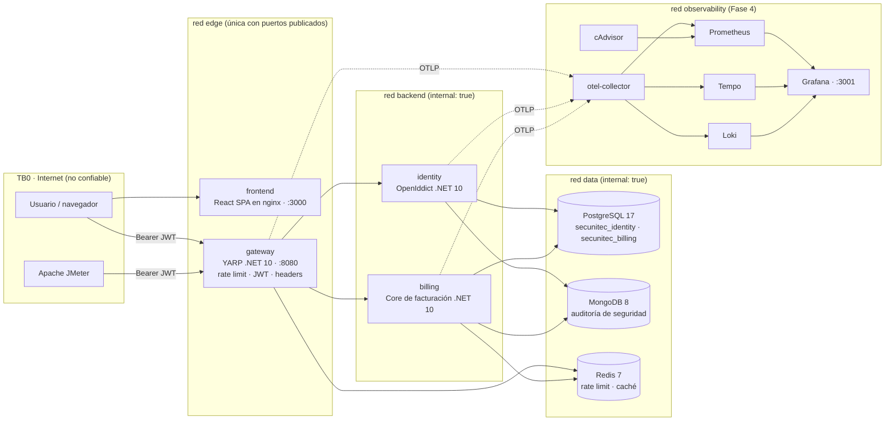
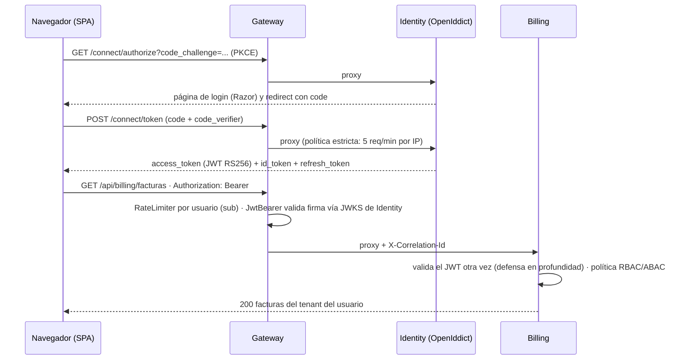
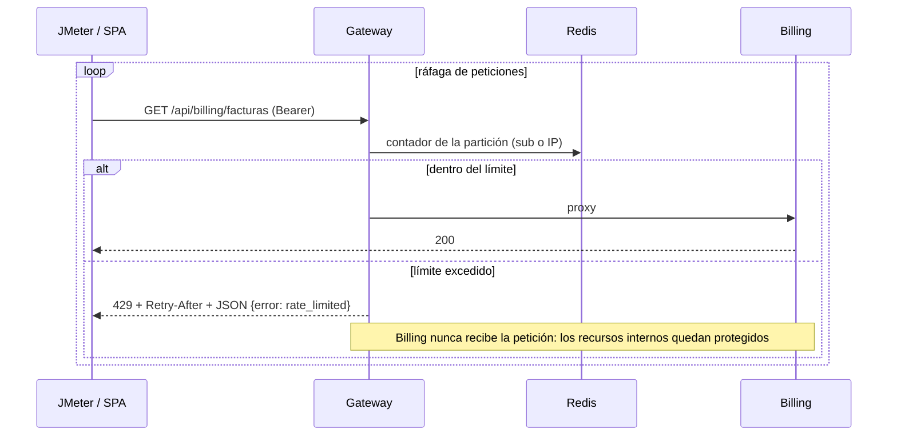

# Plan de arquitectura e implementación: Secunitec Corp.

| Campo | Valor |
|---|---|
| Curso | Arquitectura de Sistemas Informáticos, UNITEC, Q3-2026 (Prof. Kevin Fúnez) |
| Proyecto | Arquitectura y Ciberseguridad: Auditoría, Diseño y Resiliencia para Secunitec Corp. |
| Repositorio | `PickleRickHND/secunitec-platform` (público, monorepo) |
| Estado | Aprobado; Etapa 1 en curso (ver §7.1) |
| Última actualización | 2026-09-22 |

Este documento es la fuente de verdad del proyecto: qué pide el enunciado, qué decidimos, cómo se estructura el repo y en qué orden se construye. Cada requisito tiene un ID (`R01`...) que se referencia desde el código, los diagramas y las pruebas para demostrar la "coherencia estricta" que exige el criterio de evaluación (a).

---

## 0. Decisiones de arquitectura (tomadas el 2026-09-21)

| Decisión | Elección | Alternativas descartadas | Razón |
|---|---|---|---|
| API Gateway | YARP sobre .NET 10 + `Microsoft.AspNetCore.RateLimiting` con contadores en Redis | Kong, Traefik, Nginx | El rate limiting y el hardening quedan como código propio evaluable, en el mismo stack que los microservicios |
| Identity Provider | .NET 10 + OpenIddict 7 + ASP.NET Core Identity | Keycloak, JWT simple sin OIDC | Cumple literalmente "OAuth 2.0 / JWT / OIDC" en un microservicio .NET 10 propio: discovery, JWKS, RS256, refresh tokens |
| Core de facturación | .NET 10, Clean Architecture (Domain / Application / Infrastructure / Api), EF Core 10 + Npgsql | | Requisito del enunciado |
| Base relacional | PostgreSQL 17 | SQL Server, MySQL, MariaDB | Dominio del equipo, `NUMERIC(18,2)` para montos, Npgsql maduro |
| NoSQL y caché | MongoDB 8 (auditoría de seguridad) + Redis 7 (contadores de rate limit y caché) | Solo Redis | Multi-modelo real y verificable, no decorativo |
| Front-End | React 19 + Vite 8 + TypeScript, SPA estática servida por nginx non-root | Next.js, Blazor WASM | Interfaz desacoplada sin runtime en servidor; CSP estricta; sin tokens del lado servidor |
| Flujo OAuth del SPA | Authorization Code + PKCE (`oidc-client-ts`) | Password grant (ROPC) | Es el flujo recomendado por el OAuth 2.0 Security BCP (RFC 9700); ROPC está desaconsejado |
| Servicio a servicio / carga | Client Credentials (cliente confidencial `jmeter-load`) | Token hardcodeado | JMeter obtiene su token de forma estándar en un setup thread group |
| Fase 4 (innovación) | OpenTelemetry Collector + Prometheus + Tempo + Loki + Grafana + cAdvisor | mTLS, WAF Coraza, service mesh | Refuerza la Fase 3 con dashboards USE en vivo; muy demostrable ante el comité. mTLS queda como extensión opcional si sobra tiempo |
| Imágenes runtime .NET | `mcr.microsoft.com/dotnet/aspnet:10.0-noble-chiseled` (distroless, non-root) | `aspnet:10.0-alpine` | Menor superficie de ataque, sin shell ni gestor de paquetes |
| Idioma | Documentación y comentarios en español; identificadores de código en inglés (convención .NET / React) | | |

---

## 1. Requisitos extraídos del enunciado

| ID | Requisito | Fuente en el PDF | Dónde se cumple |
|---|---|---|---|
| R01 | Punto de entrada único con enrutamiento dinámico hacia microservicios | Componente 1 | `src/Gateway` (YARP) |
| R02 | Rate limiting capa 7 con respuesta defensiva 429 | Componente 1, Fase 3 | `src/Gateway` (RateLimiter + Redis) |
| R03 | Gestión de usuarios, emisión, firma y validación con OAuth 2.0 / JWT / OIDC | Componente 2 | `src/Identity` (OpenIddict) |
| R04 | Ningún servicio interno procesa peticiones anónimas | Componente 2 | JWT validado en Gateway y `FallbackPolicy` deny-by-default en Identity y Billing |
| R05 | Core transaccional en .NET 10 con código limpio | Componente 3 | `src/Billing` (Clean Architecture) |
| R06 | Supresión de cabeceras `Server` y `X-Powered-By` | Componente 3 | Kestrel `AddServerHeader=false` en los 3 servicios + transform de YARP |
| R07 | SQL transaccional para facturas y obligados tributarios con integridad | Componente 4 | PostgreSQL + EF Core + constraints |
| R08 | NoSQL / caché para auditoría, bitácoras y latencia | Componente 4 | MongoDB (auditoría) + Redis (caché, contadores) |
| R09 | Front desacoplado que consume servicios protegidos por JWT | Componente 5 | `src/Frontend` + `oidc-client-ts` |
| R10 | Visualización en tiempo real de bloqueos 429 | Componente 5 | Panel de resiliencia del SPA |
| R11 | `docker-compose.yml` unificado que levanta todo | Fase 2 | raíz del repo |
| R12 | Redes aisladas | Fase 2 | redes `edge`, `backend`, `data`, `observability` |
| R13 | Modelado de amenazas STRIDE por componente | Fase 1 | `docs/01-modelado-amenazas-stride.md` |
| R14 | SecurUML: RBAC/ABAC y trust boundaries en UML | Fase 1 | `docs/02-securuml/` |
| R15 | Mapeo de riesgos a OWASP Top 10 | Fase 1 | `docs/03-owasp-top10-mapeo.md` |
| R16 | Plan JMeter de alta concurrencia contra gateway y microservicios | Fase 3 | `tests/jmeter/` |
| R17 | Telemetría con `docker stats` y Método USE | Fase 3 | `scripts/stress/`, `docs/05-pruebas-estres-use.md` |
| R18 | Evidencia empírica: 429 controlados en vez de 500 | Fase 3 | informe USE + dashboards Grafana |
| R19 | Tecnología avanzada no vista en clase, con justificación | Fase 4 | stack OpenTelemetry + `docs/06-innovacion-opentelemetry.md` |
| R20 | Informe técnico con estructura formal | Entregable (a) | `docs/informe/` (DOCX) |
| R21 | Presentación ejecutiva de 30 minutos | Entregable (b) | `docs/presentacion/` (PPTX) |
| R22 | Instructivo de ejecución vía Docker Compose | Entregable (a) | `README.md` |

---

## 2. Arquitectura

### 2.1 Vista de contenedores y redes



Solo `gateway` (8080), `frontend` (3000) y `grafana` (3001) publican puertos en el host. `backend` y `data` son redes `internal: true`: ni las bases de datos ni los microservicios son alcanzables desde fuera del compose.

### 2.2 Flujo de autenticación (OIDC Authorization Code + PKCE)



### 2.3 Flujo de una ráfaga y del bloqueo 429



### 2.4 Fronteras de confianza (trust boundaries)

| ID | Frontera | Qué la cruza | Control en la frontera |
|---|---|---|---|
| TB0 | Internet → edge | Navegador, JMeter | TLS (dev cert) en gateway, rate limiting, validación JWT, headers de seguridad, límites de tamaño y timeouts |
| TB1 | edge → backend | Solo el gateway | Red `internal`, JWT re-validado en cada microservicio, `X-Forwarded-*` controlados |
| TB2 | backend → data | Identity y Billing | Red `internal`, credenciales distintas por servicio y por base, sin puertos publicados |
| TB3 | servicios → observability | Exportadores OTLP | Red separada, Grafana con login, sin datos sensibles en trazas |

---

## 3. Dominio: facturación electrónica (contexto Honduras)

### 3.1 Entidades y reglas

| Entidad | Atributos clave | Reglas de negocio |
|---|---|---|
| `ObligadoTributario` (tenant) | `Rtn` (VO, 14 dígitos), `RazonSocial`, `Cai` (VO), rango autorizado (desde, hasta), `FechaLimiteEmision`, prefijo `000-001-01`, `Activo` | Un CAI vigente por obligado; no emite fuera del rango ni pasada la fecha límite |
| `Cliente` | `ObligadoId`, `Rtn` o identidad, `Nombre`, `Email` | Pertenece a un solo obligado |
| `Factura` | `ObligadoId`, `ClienteId`, `Numero` (correlativo `000-001-01-00000001`), `Fecha`, `Estado`, `Subtotal`, `Isv`, `Total`, `CreadaPor`, `Lineas` | Totales calculados en el dominio; ISV 15 % sobre líneas no exentas; correlativo atómico (transacción + bloqueo de fila); estados `Borrador → Emitida → Anulada` |
| `LineaFactura` | `Descripcion`, `Cantidad`, `PrecioUnitario`, `Exento`, `Importe` | Cantidad y precio positivos; `NUMERIC(18,2)` |
| `EventoAuditoria` (Mongo) | `Timestamp`, `Actor`, `Accion`, `Recurso`, `Resultado`, `Ip`, `CorrelationId`, `Detalle` | Solo inserción; nunca se actualiza ni borra desde la aplicación |

### 3.2 Control de acceso: RBAC + ABAC

| Rol | Puede | No puede |
|---|---|---|
| `Admin` | Gestionar obligados, usuarios y roles; todo lo de los demás roles | |
| `Facturador` | Crear, emitir y anular facturas; gestionar clientes de su tenant | Ver auditoría; tocar otro tenant |
| `Auditor` | Leer facturas y auditoría de su tenant | Escribir |
| `Cliente` | Leer solo sus propias facturas | Todo lo demás |

Atributos (ABAC) en el JWT: `tenant_id` (= `ObligadoId`) y `cliente_id` cuando el rol es `Cliente`. Billing aplica un filtro global de EF Core por `tenant_id`; ningún endpoint recibe el tenant como parámetro del cliente.

---

## 4. Controles de seguridad (mapa preliminar STRIDE → control → OWASP)

Se detalla en `docs/01`, `docs/03` y `docs/trazabilidad.md` con `archivo:línea` cuando exista el código.

| STRIDE | Componente | Amenaza | Control | OWASP Top 10 (2021) |
|---|---|---|---|---|
| Spoofing | Identity | Adivinanza o robo de credenciales | PKCE, lockout tras 5 intentos, hash de contraseñas de ASP.NET Identity, rate limit estricto en `/connect/token`, auditoría de logins fallidos | A07 |
| Spoofing | Gateway, Billing | Token falsificado o reutilizado | RS256 + JWKS, validación de `iss`, `aud`, `exp`, `nbf`; access tokens de vida corta (15 min) con refresh rotativo | A02, A07 |
| Tampering | Billing | Manipular montos, IDs o el tenant en el request | FluentValidation, totales calculados en dominio, EF Core parametrizado, tenant solo desde el claim | A03, A04 |
| Tampering | Front-End | Modificar el JWT o el estado en el navegador | La autorización se decide siempre en servidor; el SPA solo oculta UI | A01 |
| Repudiation | Identity, Billing | Negar una emisión, anulación o login | Auditoría append-only en Mongo con actor, IP, correlation id y resultado | A09 |
| Information disclosure | Todos | Fingerprinting, stack traces, headers | Sin `Server` ni `X-Powered-By`, `ProblemDetails` sin detalles internos, CSP, `nosniff`, `frame-deny`, HSTS | A05 |
| Information disclosure | Datos | Acceso directo a las bases | Redes `internal`, sin puertos publicados, credenciales por servicio, Redis con `requirepass`, Mongo con auth | A02, A05 |
| Denial of service | Gateway | Saturación por ráfagas | Rate limiting L7 (429 + `Retry-After`), límites de tamaño de body, timeouts, `deploy.resources.limits` en Docker | A04 (diseño), A05 |
| Elevation of privilege | Billing | Acceder a otro tenant o a acciones de otro rol | Políticas RBAC por endpoint, filtro ABAC por tenant, `FallbackPolicy` deny-by-default | A01 |
| Supply chain | Todo el repo | Dependencias vulnerables, secretos filtrados | `gitleaks` y auditoría de paquetes en CI, versiones centralizadas, imágenes chiseled | A06, A08 |

---

## 5. Estructura del repositorio

```
secunitec-platform/
├── README.md                              # instructivo de ejecución (R22)
├── docker-compose.yml                     # todo el sistema (R11, R12)
├── docker-compose.observability.yml       # stack de Fase 4 (perfil opcional)
├── .env.example                           # variables sin valores reales
├── .editorconfig                          # estilo C# (file-scoped namespaces, naming, LF)
├── global.json                            # SDK 10.0.400; dotnet test en modo Microsoft.Testing.Platform
├── Directory.Build.props                  # nullable, warnings como errores, analizadores, EnforceCodeStyleInBuild
├── Directory.Packages.props               # versiones centralizadas de NuGet
├── Secunitec.slnx
├── src/
│   ├── BuildingBlocks/
│   │   ├── Secunitec.BuildingBlocks/          # puro (sin ASP.NET): claims, roles, políticas, ICurrentUser, correlation id
│   │   └── Secunitec.BuildingBlocks.AspNetCore/  # middlewares (headers, correlation), ProblemDetails, autorización R04, Kestrel R06; luego auditoría Mongo y OTel
│   ├── Gateway/Secunitec.Gateway/
│   ├── Identity/Secunitec.Identity/
│   ├── Billing/
│   │   ├── Secunitec.Billing.Domain/
│   │   ├── Secunitec.Billing.Application/
│   │   ├── Secunitec.Billing.Infrastructure/
│   │   └── Secunitec.Billing.Api/
│   └── Frontend/                          # React 19 + Vite 8 + TypeScript
├── tests/
│   ├── Directory.Build.props              # IsTestProject, runner MTP, global using Xunit
│   ├── Secunitec.BuildingBlocks.Tests/    # xUnit v3: contrato del token, políticas, middlewares, Kestrel
│   ├── Secunitec.Billing.Domain.Tests/    # xUnit v3: reglas de negocio
│   ├── Secunitec.Billing.Api.Tests/       # integración con Testcontainers (Postgres + Mongo)
│   ├── Secunitec.Identity.Tests/          # discovery, token, lockout
│   ├── Secunitec.Gateway.Tests/           # 401, 429 + Retry-After, headers
│   ├── e2e/                               # Playwright
│   └── jmeter/                            # 01-baseline.jmx, 02-ramp-saturation.jmx, 03-spike.jmx
├── infra/
│   ├── postgres/init/01-databases.sql
│   ├── mongo/init/01-audit.js
│   ├── redis/redis.conf
│   ├── nginx/nginx.conf                   # SPA + CSP
│   ├── otel/otel-collector.yaml
│   ├── prometheus/prometheus.yml
│   ├── tempo/tempo.yaml
│   ├── loki/loki.yaml
│   └── grafana/provisioning/{datasources,dashboards}/
├── scripts/
│   ├── stress/run-jmeter.sh
│   ├── stress/capture-docker-stats.sh     # docker stats → CSV cada segundo
│   ├── verify-hardening.sh                # curl: headers, 401, 403, 429; docker network inspect
│   └── export-diagrams.sh                 # Mermaid → PNG/SVG para el informe
├── docs/
│   ├── PLAN.md                            # este documento
│   ├── 01-modelado-amenazas-stride.md
│   ├── 02-securuml/                       # .mmd, .puml y exportados
│   ├── 03-owasp-top10-mapeo.md
│   ├── 04-hardening-verificacion.md
│   ├── 05-pruebas-estres-use.md
│   ├── 06-innovacion-opentelemetry.md
│   ├── trazabilidad.md                    # R → amenaza → OWASP → archivo:línea → prueba
│   ├── informe/                           # DOCX final y fuentes
│   └── presentacion/                      # PPTX final
└── .github/workflows/ci.yml               # build + test .NET, lint + test front, compose config, gitleaks
```

---

## 6. Stack y versiones (verificadas el 2026-09-21)

| Componente | Versión |
|---|---|
| .NET SDK | 10.0.400 (`global.json`) |
| OpenIddict.AspNetCore / EntityFrameworkCore / Validation.AspNetCore | 7.7.1 |
| Yarp.ReverseProxy | 2.3.0 |
| Microsoft.EntityFrameworkCore | 10.0.12 |
| Npgsql.EntityFrameworkCore.PostgreSQL | 10.0.3 |
| MongoDB.Driver | 3.12.0 |
| FluentValidation | 12.1.1 |
| StackExchange.Redis | 3.3.0 |
| RedisRateLimiting (comunitario; verificar mantenimiento en H4) | 1.2.1 |
| OpenTelemetry.* | 1.19.x |
| Microsoft.AspNetCore.Authentication.JwtBearer | 10.0.12 |
| xunit.v3 / xunit.runner.visualstudio | 4.0.1 / 4.0.0 (modo Microsoft.Testing.Platform; sin `Microsoft.NET.Test.Sdk`) |
| Microsoft.AspNetCore.TestHost | 10.0.12 |
| Testcontainers.PostgreSql | 4.15.0 |
| React / Vite / @vitejs/plugin-react | 19.3 / 8.3 / 6.1 |
| react-router-dom / oidc-client-ts | 7.18 / 3.5 |
| Vitest / @playwright/test | 5.0 / 1.63 |
| Imágenes | `postgres:17-alpine`, `mongo:8`, `redis:7-alpine`, `nginxinc/nginx-unprivileged:alpine`, `mcr.microsoft.com/dotnet/aspnet:10.0-noble-chiseled`, `otel/opentelemetry-collector-contrib`, `prom/prometheus`, `grafana/tempo`, `grafana/loki`, `grafana/grafana`, `gcr.io/cadvisor/cadvisor` |
| Herramientas locales | Docker 29 + Compose v5.5, JMeter (Homebrew) + Java 23, Node 22 solo para desarrollo del front (el compose lo construye en multi-stage) |

---

## 7. Hitos de implementación

El orden minimiza dependencias: primero infraestructura, luego el emisor de tokens (todo lo demás depende de él), el core, el gateway que los une, el front que los consume, y al final la observabilidad antes de las pruebas de estrés para tener evidencia en dashboards.

| Hito | Contenido | Depende de | Pruebas / criterio de done |
|---|---|---|---|
| **H0** Plan y repo | Este documento, `README.md`, `.gitignore`, repo público | | Plan aprobado por el equipo |
| **H1** Infraestructura base | `docker-compose.yml` con Postgres, Mongo, Redis y las 4 redes; init scripts; healthchecks; `.env.example`; `global.json`, `Directory.*.props`, `Secunitec.slnx`; CI base | Docker Desktop encendido | `docker compose config` válido; `docker compose up` con las 3 bases `healthy`; CI verde |
| **H2** Identity | Proyecto con ASP.NET Core Identity + EF (Postgres); OpenIddict con Authorization Code + PKCE, Refresh Token y Client Credentials; login Razor mínimo; seed de usuarios, roles y clientes (`spa-secunitec` público, `jmeter-load` confidencial); JWT RS256 sin cifrar; claims `role`, `tenant_id`, `cliente_id`; discovery + JWKS; auditoría de login en Mongo; headers de seguridad; Dockerfile chiseled | H1 | Integración: discovery 200, token por client credentials, login fallido auditado, lockout. `curl /.well-known/openid-configuration` desde el compose |
| **H3** Billing | Domain (entidades, VOs, reglas, estados) con tests unitarios; Application (casos de uso, validadores, políticas); Infrastructure (EF migrations, repositorio de auditoría Mongo, caché Redis); Api (endpoints, JwtBearer con `Authority` = identity, `FallbackPolicy`, `ProblemDetails`); Dockerfile | H1, H2 | Unit: ISV, totales, correlativo, transiciones. Integración (Testcontainers): crear → emitir → anular; aislamiento de tenant (403); evento de auditoría escrito |
| **H4** Gateway | YARP routes/clusters; políticas de rate limit (`anon-by-ip`, `user-by-sub`, `token-endpoint`) sobre Redis; `OnRejected` → 429 + `Retry-After` + JSON; JwtBearer; headers; transforms que quitan `Server`/`X-Powered-By`; límites de body y timeouts; correlation id; health | H2, H3 | Integración: 401 sin token; 429 con `Retry-After` tras N peticiones; headers correctos. `scripts/verify-hardening.sh` verde |
| **H5** Frontend | Scaffold Vite; `oidc-client-ts` PKCE; rutas protegidas por rol; facturas (listar, crear, emitir, anular); auditoría (Auditor); panel de resiliencia (ráfaga configurable, contadores 200/401/403/429 en vivo, countdown de `Retry-After`, gráfica); nginx + CSP; Dockerfile multi-stage | H2, H4 | Vitest: parsing de 429/`Retry-After`. Playwright: login, crear factura, ver 429 en el panel |
| **H6** Hardening integral | `cap_drop: [ALL]`, `read_only`, `no-new-privileges`, usuario non-root, `deploy.resources.limits`, secretos solo por `.env`; `docker network inspect`; gitleaks y auditoría de dependencias en CI; `docs/04` con la salida real de cada comando | H1-H5 | Checklist con evidencia reproducible |
| **H7** Documentación Fase 1 | STRIDE por componente (IDs `T-xx`); SecurUML en Mermaid + PlantUML: despliegue con trust boundaries, clases con estereotipos de roles y permisos, casos de uso con actores, secuencias; mapeo OWASP; `trazabilidad.md` con `archivo:línea` | H2-H5 (para citar código real) | Revisión cruzada del equipo: cada amenaza tiene control y evidencia |
| **H8** Fase 4: OpenTelemetry | SDK OTel en los 3 servicios (trazas, métricas, logs); métricas propias (`secunitec_gateway_rate_limited_total`, `secunitec_billing_invoices_emitted_total`); collector, Prometheus, Tempo, Loki, cAdvisor; dashboards provisionados: "USE Overview", "Resiliencia del gateway", "Trazas"; `docs/06` con justificación y ventaja competitiva | H4, H5 | Dashboards muestran tráfico real del compose; trazas cruzan gateway → billing → Postgres |
| **H9** Fase 3: estrés y USE | Planes JMeter (baseline 50 usuarios, rampa 0 → 500, spike 1000) con setup thread group que obtiene token; `run-jmeter.sh` y `capture-docker-stats.sh`; ejecución real; tabla USE por recurso (CPU, memoria, red, conexiones DB, thread pool); gráficas 429 vs 500; `docs/05` | H8 | Reporte HTML de JMeter + CSV de `docker stats` + dashboards; 5xx = 0 durante saturación |
| **H10** Entregables | Informe técnico DOCX con la estructura del enunciado (portada, índices, objetivos, introducción, marco teórico, desarrollo con evidencias, conclusiones, recomendaciones, bibliografía); presentación PPTX de 30 min; README final; tag `v1.0` | Todo | Revisión final del equipo |

### 7.1 Etapas y pistas del equipo

El equipo ejecuta los hitos anteriores en cinco etapas y tres pistas paralelas (A, B, C). La Etapa 1 no requiere Docker.

| Etapa | Contenido | Hito(s) | Pista |
|---|---|---|---|
| **1.1** | Proyecto base: solución .NET, reglas comunes de build, bloques comunes y contrato del token (rol, empresa). CI base | H1 (parte sin Docker) + contrato compartido de H2/H3 | A |
| **1.2** | Reglas de facturación (`Billing.Domain`): factura, líneas, ISV, correlativo por CAI, estados. Pruebas unitarias | H3 (Domain) | B |
| **1.3** | Acciones de facturación (`Billing.Application`): crear, emitir, anular, listar; clientes y obligados; permisos por rol. Probado con datos falsos | H3 (Application) | B |
| **2.1** | Postgres, Mongo y Redis en contenedores con redes aisladas | H1 (compose) | B |
| **2.2** | `Billing.Infrastructure` + `Billing.Api`: Postgres, auditoría Mongo, caché Redis, endpoints `/api/billing/...`. Probado con token de prueba | H3 (Infrastructure, Api) | B |
| **3.1** | Identity: registro, login y emisión de JWT con OAuth 2.0 / OIDC | H2 | A |
| **3.2** | Gateway: única entrada, validación de token, rate limiting 429, supresión de cabeceras | H4 | A |
| **4.1** | Frontend: login, facturas y panel de bloqueos 429 en vivo | H5 | C |
| **4.2** | Endurecer y verificar: contenedores non-root con límites; script de verificación con evidencia | H6 | A |
| **5.1** | Fase 1: STRIDE, SecurUML, mapeo OWASP, trazabilidad | H7 | Todos |
| **5.2** | Fase 4: OpenTelemetry y Grafana | H8 | C |
| **5.3** | Fase 3: JMeter, `docker stats`, Método USE | H9 | C |
| **5.4** | Informe técnico y presentación ejecutiva | H10 | Todos |

#### Contrato del token (cerrado en 1.1)

Claims crudos, sin mapeo a `ClaimTypes.*`: `sub` (Guid), `role` (multivalor: `Admin`, `Facturador`, `Auditor`, `Cliente`), `tenant_id` (Guid, **obligatorio en todo token de usuario, incluido Admin**), `cliente_id` (Guid, solo con rol `Cliente`), `client_id` (aplicaciones OAuth, p. ej. `jmeter-load`), `aud` = `secunitec-billing`. Constantes en `src/BuildingBlocks/Secunitec.BuildingBlocks/Security/`; políticas `secunitec:*` con su matriz rol → política en `SecunitecPolicies.RolesByPolicy`; `FallbackPolicy` = autenticado con `tenant_id` (R04). Si más adelante hace falta un administrador de plataforma cross-tenant, se agrega como rol aparte sin cambiar este contrato.

---

## 8. Estrategia de pruebas

| Tipo | Alcance | Herramienta |
|---|---|---|
| Unitarias | Reglas de dominio: ISV, totales, correlativo, transiciones de estado, VOs `Rtn` y `Cai` | xUnit v3 |
| Integración | Endpoints de Billing e Identity contra Postgres y Mongo reales; aislamiento de tenant; auditoría | xUnit v3 + Testcontainers + `WebApplicationFactory` |
| Contrato del gateway | 401, 403, 429 + `Retry-After`, headers suprimidos y agregados | xUnit v3 + `WebApplicationFactory` |
| Front unitarias | Cliente HTTP: manejo de 429 y countdown | Vitest |
| E2E | Login PKCE → crear factura → emitir → panel de resiliencia muestra 429 | Playwright contra el compose |
| Carga | Baseline, rampa a saturación, spike | Apache JMeter + `docker stats` |
| Seguridad estática | Secretos y dependencias | gitleaks, `dotnet list package --vulnerable`, `pnpm audit` |

---

## 9. Convenciones

- Commits: Conventional Commits (`feat(gateway): ...`, `docs(stride): ...`). Sin atribución a herramientas.
- Ramas: `feature/<etapa>-<nombre>` (ej. `feature/1.1-proyecto-base`); PR a `main` con CI verde; `main` protegida.
- Código: identificadores en inglés, comentarios y documentación en español. `Nullable` y `TreatWarningsAsErrors` activados. DTOs como `record`.
- Secretos: solo en `.env` (git-ignored); `.env.example` con placeholders. `gitleaks git --staged` antes de cada commit.
- Cada control de seguridad en código lleva un comentario con su ID (`// R06: ...`, `// T-03: ...`) para la trazabilidad.
- Tests: xUnit v3 en modo Microsoft.Testing.Platform (`global.json` → `test.runner`); nombres `Metodo_Escenario_Resultado`; `TestContext.Current.CancellationToken` en llamadas async.

---

## 10. Riesgos y mitigaciones

| Riesgo | Mitigación |
|---|---|
| Docker Desktop apagado en la máquina de desarrollo (estado al 2026-09-21) | Encender antes de H1; documentar requisitos en README |
| Compatibilidad OpenIddict 7.7 con .NET 10 | Verificar changelog al iniciar H2; fallback a la última 6.x compatible |
| `RedisRateLimiting` es un paquete comunitario | Verificar mantenimiento; fallback documentado: limiter en memoria (una sola instancia de gateway) |
| JMeter sale de una sola IP: un límite por IP bloquearía todo al instante | Particiones por `sub`/`client_id` cuando hay token; por IP solo para anónimos; el plan usa varios clientes y usuarios |
| Difícil saturar en una laptop | `deploy.resources.limits` bajos para Billing (por ejemplo 0.5 CPU, 256 MB) para alcanzar saturación con cientos de hilos; documentar el porqué |
| Tiempo del equipo | Reparto por hitos (sección 11) y PRs pequeños |

---

## 11. Reparto sugerido del equipo

| Persona | Hitos | Entregables |
|---|---|---|
| A | H2 Identity, H4 Gateway | OAuth/OIDC, rate limiting, `docs/04` |
| B | H3 Billing | Dominio, EF, Mongo, Redis, tests |
| C | H5 Frontend, E2E | SPA, panel de resiliencia, Playwright |
| D | H1, H6, H8, H9 | Compose, hardening, OTel, JMeter, `docs/05` y `docs/06` |
| Todos | H7, H10 | STRIDE, SecurUML, OWASP, informe y presentación |

Si el equipo es más pequeño, se combinan A+D y B+C manteniendo el orden de hitos.
